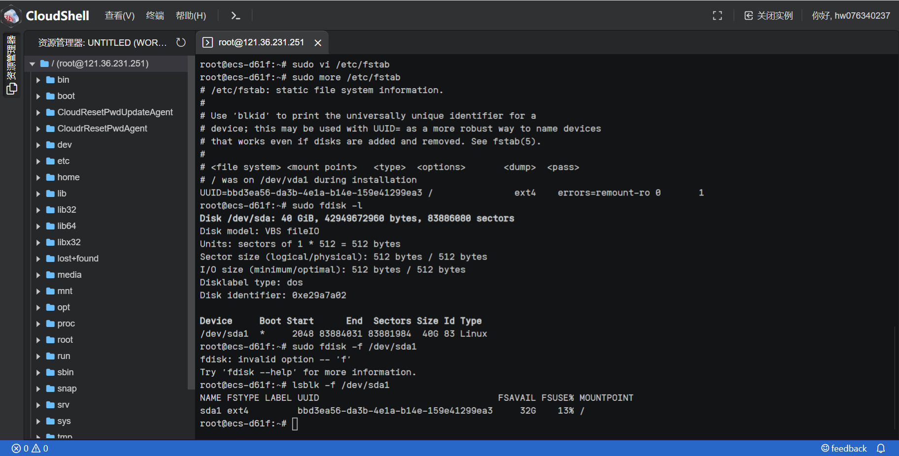
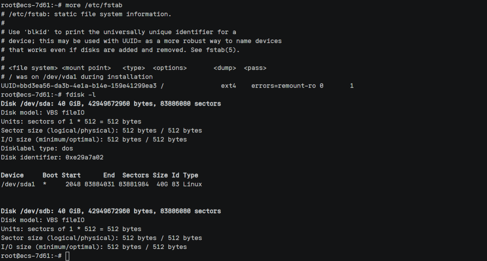
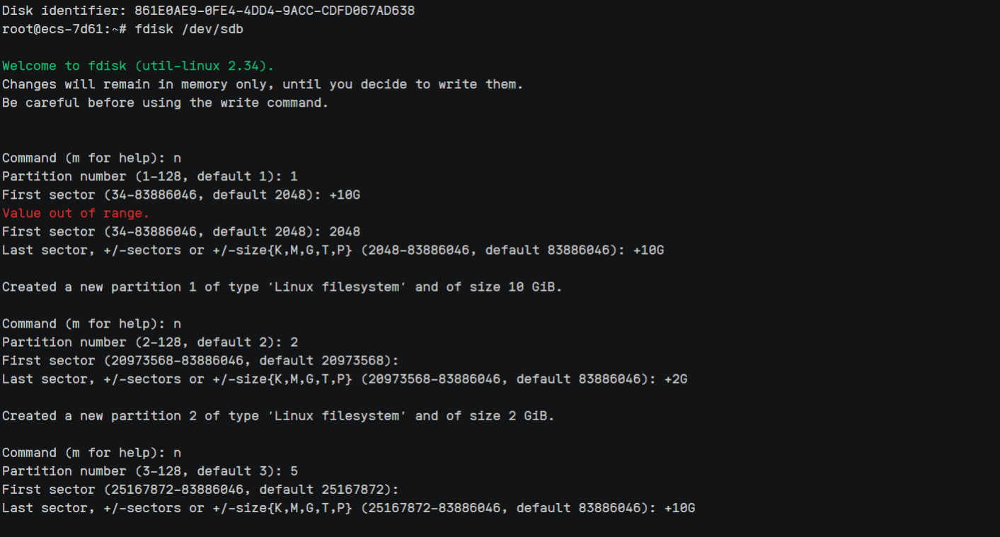
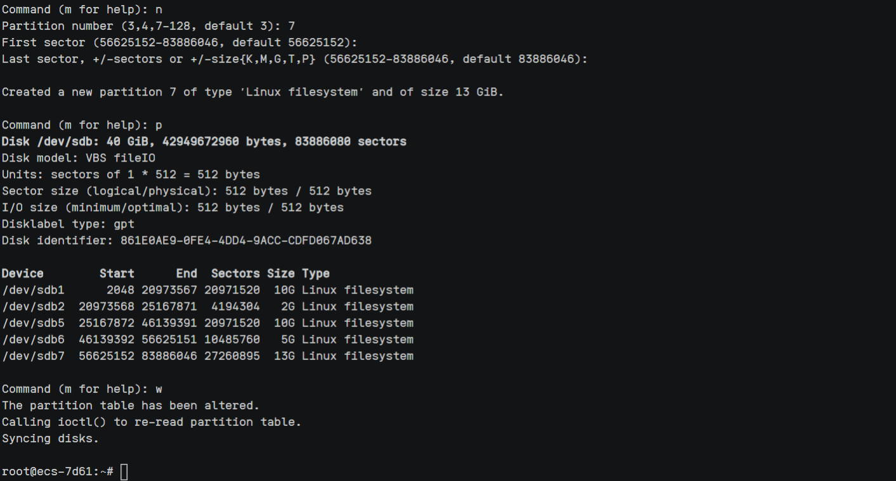
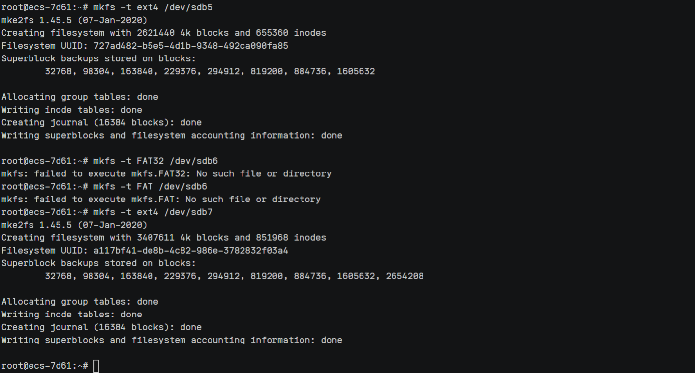
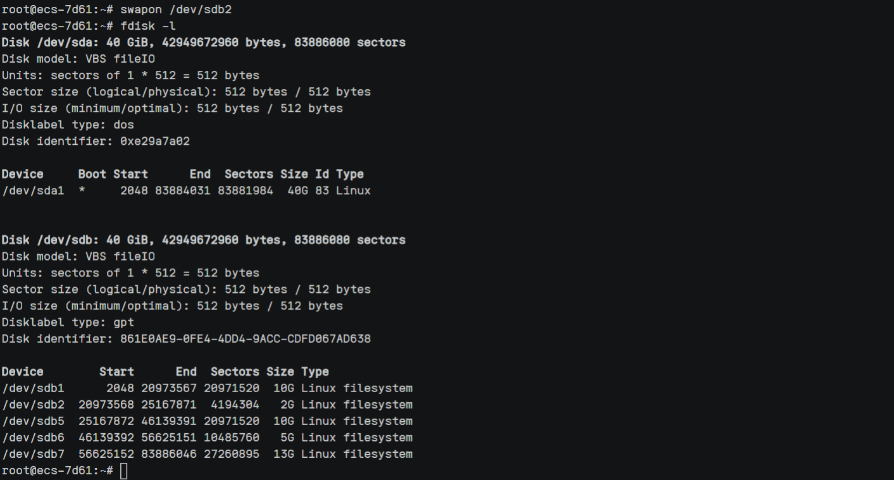
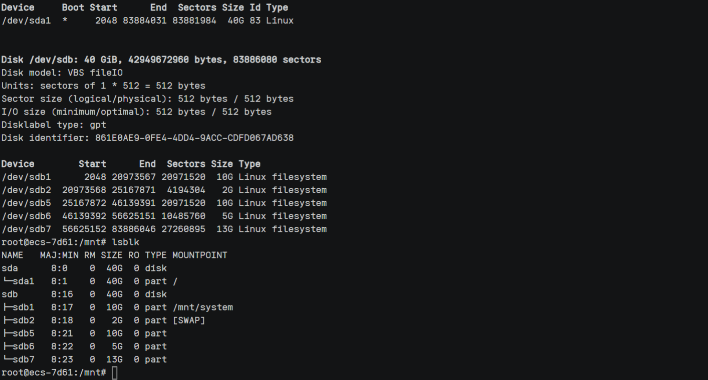
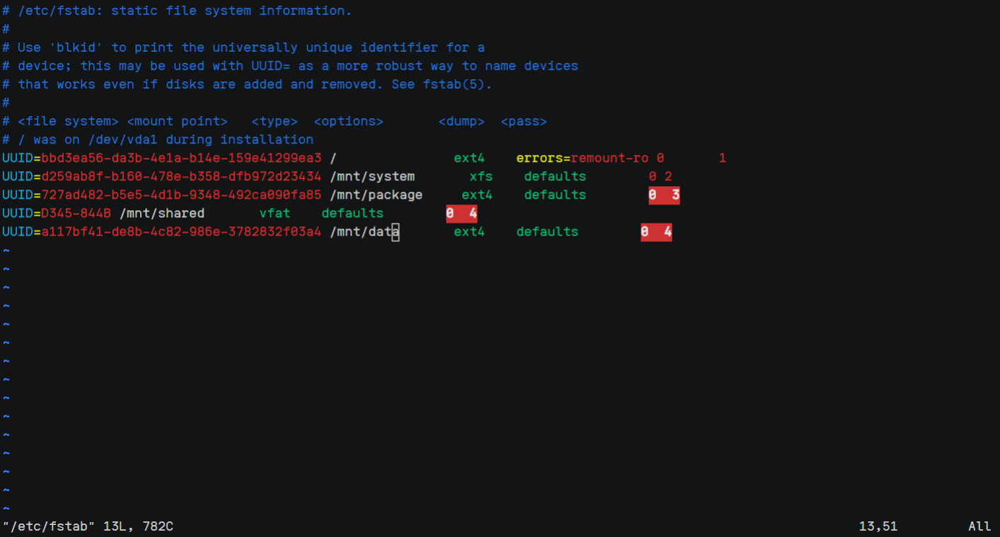

## 磁盘实验报告

> 任栋 20052219
>
> 2022-06-05

### ECS环境

华为云ECS 2vCPUs | 4GiB | c7.large.2

Ubuntu 20.04 server 64bit

上海一 可用区3

### EVS环境

华为云EVS 通用型SSD 容量 40GB 磁盘模式 VBD

上海一 可用区3

### /etc/fstab 文件

输入命令查看文件

```shell
more /etc/fstab
```

由于笔者使用的系统是Ubuntu，和蓝桥云上的内容有较大的出入。该文件的含义如下：

第一列表示文件系统，名称

第二列表示挂载路径，设备的挂载点

第三列是硬盘的文件系统类型，相应的有ntfs，ext4，fat，vfat等等，这里要根据实际情况设置，同样的也可以通过指令blkid。

第四列是挂载选项

第五列是dump选项，这个参数用来检查文件系统以多快频率进行备份，系统将认为其值为0，则不需要进行备份。

第六列表示文件系统检查fsck选项，这个参数用来决定在启动时需要被fsck扫描的文件系统的顺序，如果设置为0则表示不扫描。



在Ubuntu的这一版本系统中，默认显示的并不是名称而是UUID。

### 常用的属性

- auto 和 noauto：控制设备是否自动挂载。auto是默认属性，设备会在启动或者使用 mount -a 命令时按照fstab的内容自动挂载。使用noauto则必须手动挂载设备。

- user 和 nouser：user属性允许普通用户挂载设备，而nouser则只允许root用户挂载。nouser是默认属性。

- exec 和 noexec： exec允许执行相应分区中的可执行程序，noexec的作用则刚好相反。挂载Windows分区的时候，常设置为noexec属性。

- ro：以只读方式挂载文件系统。

- rw：以可读可写方式挂载文件系统。

- sync 和 async：输入输出的完成方式，当复制到设备或者分区中时，所有的写入变化是否立刻生效。sync 是同步完成，立刻写入设备；async是异步完成，实际的写入操作可能会过一会儿才执行，就是进行了缓冲处理。移动存储设备建议使用sync，避免忘记umount而拔出造成数据丢失。

- defaults：表示所有选项全部使用默认配置，包括rw, suid, dev, exec, auto, nouser,和 async。一般没有特殊需求，就使用defaults。

### 添加硬盘

通过查阅华为云官方文档，数据盘购买后需要挂载至云服务器。

在云磁盘控制台挂载到指定虚拟机后，查看

```shell
fdisk -l
```



表示当前的云服务器有两块磁盘，/dev/sdb是新增数据盘。

### 格式化-分区

使用fdisk对新增的/dev/sdb格式化

```shell
fdisk /dev/vdb
```



根据题目中给出的要求划分分区

分区1 主分区 xfs文件系统 10GB

分区2 主分区 swap文件系统 2GB

分区5 逻辑分区 ext4文件系统 10GB

分区6 逻辑分区 FAT32文件系统 5GB

分区7 逻辑分区 ext4文件系统 余下

得到下列回显信息：

```shell
Device        Start      End  Sectors Size Type
/dev/sdb1      2048 20973567 20971520  10G Linux filesystem
/dev/sdb2  20973568 25167871  4194304   2G Linux filesystem
/dev/sdb5  25167872 46139391 20971520  10G Linux filesystem
/dev/sdb6  46139392 56625151 10485760   5G Linux filesystem
/dev/sdb7  56625152 83886046 27260895  13G Linux filesystem
```



此时只是划分了大小，还需要通过其他方法指定文件系统类型。

将分区结果写入分区表后，将新的分区表变更同步至操作系统。

```shell
partprobe
```

### 格式化-指定文件格式

按照题目要求，将新建分区文件系统设为系统所需格式。

```shell
mkfs -t xfs /dev/sdb1
mkfs -t swap /dev/sdb2
mkfs -t ext4 /dev/sdb5
mkfs -t FAT32 /dev/sdb6
mkfs -t ext4 /dev/sdb7
```

文件系统需要指定为swap和FAT32的两个分区并没有设置成功，其余成功，/dev/sdb7得到回显信息如下：

```shell
root@ecs-7d61:~# mkfs -t ext4 /dev/sdb7
mke2fs 1.45.5 (07-Jan-2020)
Creating filesystem with 3407611 4k blocks and 851968 inodes
Filesystem UUID: a117bf41-de8b-4c82-986e-3782832f03a4
Superblock backups stored on blocks: 
        32768, 98304, 163840, 229376, 294912, 819200, 884736, 1605632, 2654208

Allocating group tables: done                            
Writing inode tables: done                            
Creating journal (16384 blocks): done
Writing superblocks and filesystem accounting information: done   
```



解决方案是自行搜索对应的文件，然后替换指令

尤其是swap文件格式是不能使用mkfs的。

```shell
root@ecs-7d61:~# mkfs -t vfat /dev/sdb6
mkfs.fat 4.1 (2017-01-24)
root@ecs-7d61:~# mkswap /dev/sdb2
Setting up swapspace version 1, size = 2 GiB (2147479552 bytes)
no label, UUID=fcf060a3-94e9-4ef3-9ca1-640fa6bbd809
root@ecs-7d61:~# swapon /dev/sdb2
root@ecs-7d61:~# 
```

### fdisk -l查看

```shell
root@ecs-7d61:~# fdisk -l
Disk /dev/sda: 40 GiB, 42949672960 bytes, 83886080 sectors
Disk model: VBS fileIO      
Units: sectors of 1 * 512 = 512 bytes
Sector size (logical/physical): 512 bytes / 512 bytes
I/O size (minimum/optimal): 512 bytes / 512 bytes
Disklabel type: dos
Disk identifier: 0xe29a7a02

Device     Boot Start      End  Sectors Size Id Type
/dev/sda1  *     2048 83884031 83881984  40G 83 Linux


Disk /dev/sdb: 40 GiB, 42949672960 bytes, 83886080 sectors
Disk model: VBS fileIO      
Units: sectors of 1 * 512 = 512 bytes
Sector size (logical/physical): 512 bytes / 512 bytes
I/O size (minimum/optimal): 512 bytes / 512 bytes
Disklabel type: gpt
Disk identifier: 861E0AE9-0FE4-4DD4-9ACC-CDFD067AD638

Device        Start      End  Sectors Size Type
/dev/sdb1      2048 20973567 20971520  10G Linux filesystem
/dev/sdb2  20973568 25167871  4194304   2G Linux filesystem
/dev/sdb5  25167872 46139391 20971520  10G Linux filesystem
/dev/sdb6  46139392 56625151 10485760   5G Linux filesystem
/dev/sdb7  56625152 83886046 27260895  13G Linux filesystem
```



### 挂载分区至相应的目录

因为所用的linux环境之前没有/mnt/system 目录，需要先新建后挂载。

```shell
cd /mnt
mkdir system
mount /dev/sdb1 /mnt/system
```

挂载后用lsblk 查看。



得到回显信息：

```shell
root@ecs-7d61:/mnt# lsblk
NAME   MAJ:MIN RM SIZE RO TYPE MOUNTPOINT
sda      8:0    0  40G  0 disk 
└─sda1   8:1    0  40G  0 part /
sdb      8:16   0  40G  0 disk 
├─sdb1   8:17   0  10G  0 part /mnt/system
├─sdb2   8:18   0   2G  0 part [SWAP]
├─sdb5   8:21   0  10G  0 part 
├─sdb6   8:22   0   5G  0 part 
└─sdb7   8:23   0  13G  0 part 
```

### 卸载分区

umount将分区1卸载

```shell
root@ecs-7d61:/mnt# umount /dev/sdb1
root@ecs-7d61:/mnt# lsblk
NAME   MAJ:MIN RM SIZE RO TYPE MOUNTPOINT
sda      8:0    0  40G  0 disk 
└─sda1   8:1    0  40G  0 part /
sdb      8:16   0  40G  0 disk 
├─sdb1   8:17   0  10G  0 part 
├─sdb2   8:18   0   2G  0 part [SWAP]
├─sdb5   8:21   0  10G  0 part 
├─sdb6   8:22   0   5G  0 part 
└─sdb7   8:23   0  13G  0 part 
```

### 挂载其余分区

在编辑/etc/fstab文件之前，需要查看各个分区的uuid。

```shell
root@ecs-7d61:~# blkid /dev/sdb1
/dev/sdb1: UUID="d259ab8f-b160-478e-b358-dfb972d23434" TYPE="xfs" PARTUUID="d8e0ad23-c656-4f4a-a178-aa4cc6379c24"
root@ecs-7d61:~# blkid /dev/sdb5
/dev/sdb5: UUID="727ad482-b5e5-4d1b-9348-492ca090fa85" TYPE="ext4" PARTUUID="dd52d358-3b27-3b4a-8398-cf5006a0ade4"
root@ecs-7d61:~# blkid /dev/sdb6
/dev/sdb6: UUID="D345-844B" TYPE="vfat" PARTUUID="ea04d64c-5dfb-f246-a35e-386745a33743"
root@ecs-7d61:~# blkid /dev/sdb7
/dev/sdb7: UUID="a117bf41-de8b-4c82-986e-3782832f03a4" TYPE="ext4" PARTUUID="08e62403-5115-dc47-bdd0-39505075a8f4"
```



### 总结

这次实验总体难度大，幸好在华为云购买云硬盘后，有官方文档教学如何挂载和初始化硬盘，挂载流程和初始化流程，包括后续的一些挂载相应目录，指定文件系统类型中的部分操作也在官方文档中，直接跟着步骤做即可。

