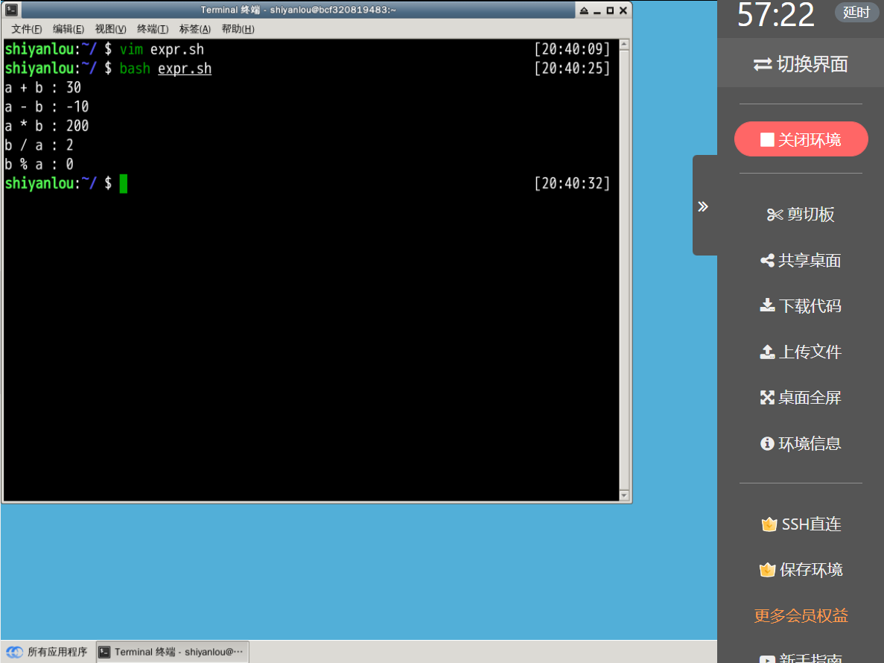
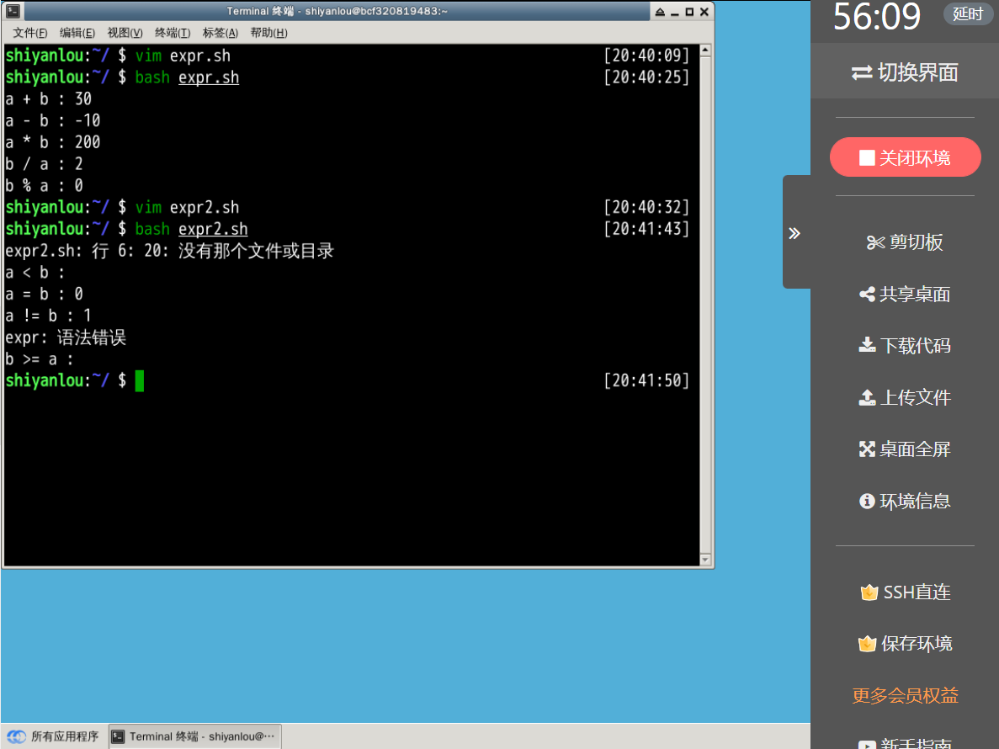
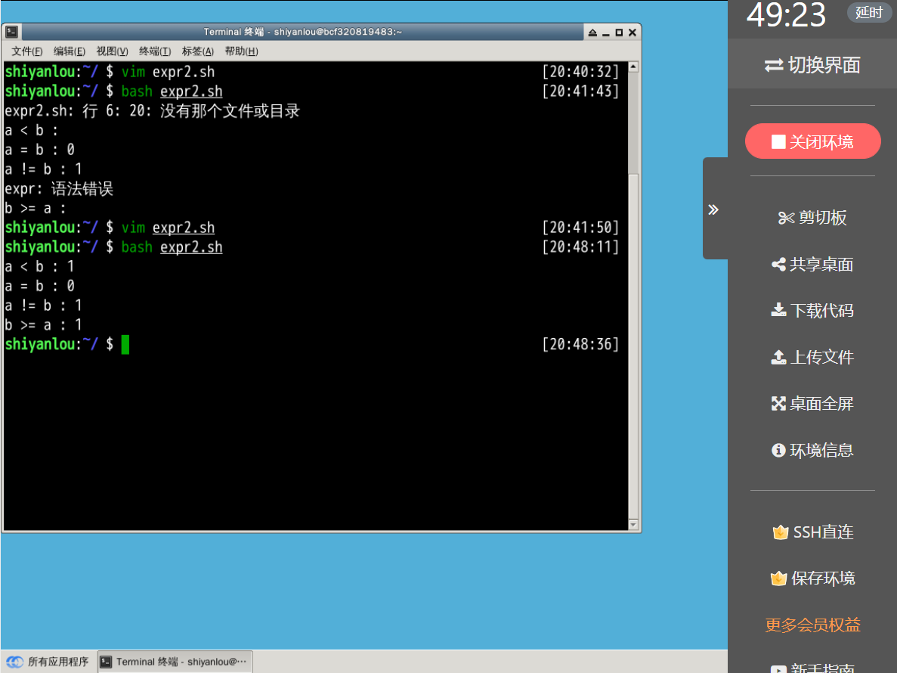
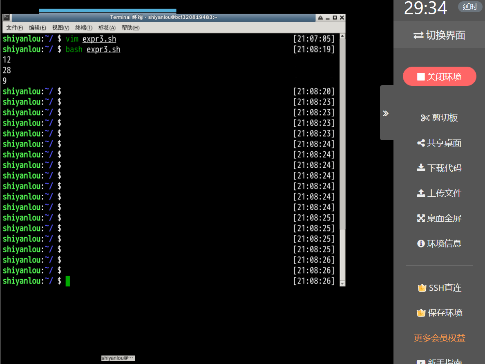
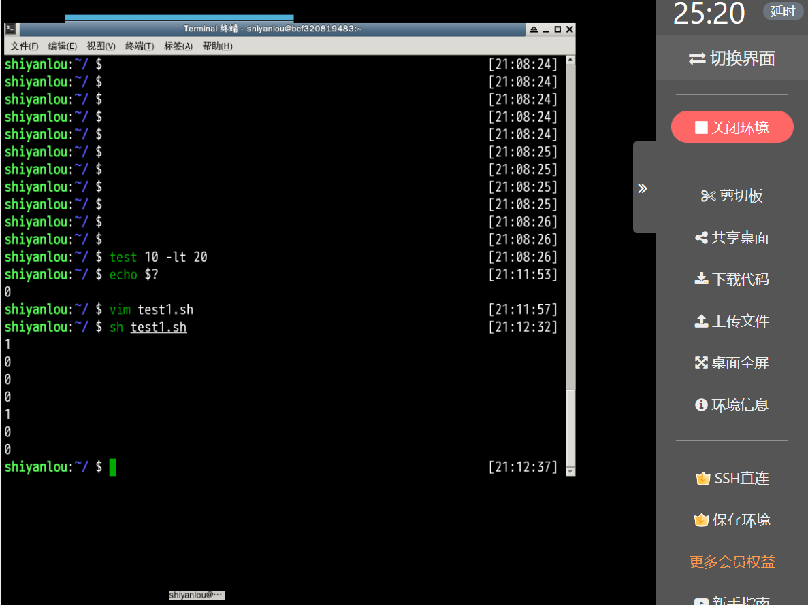
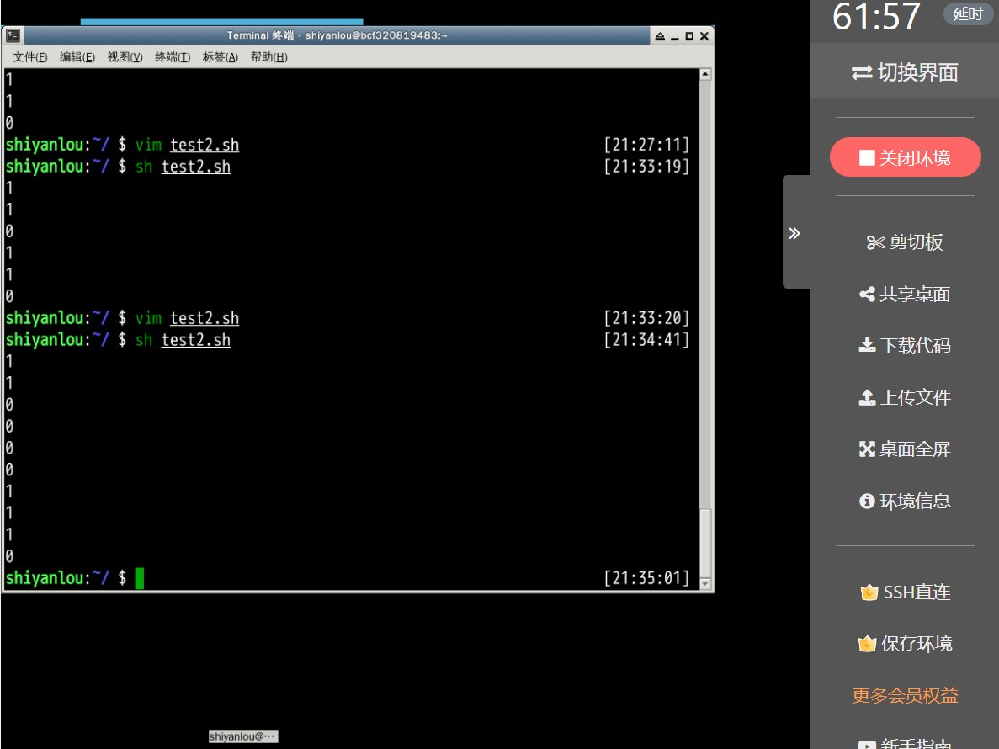
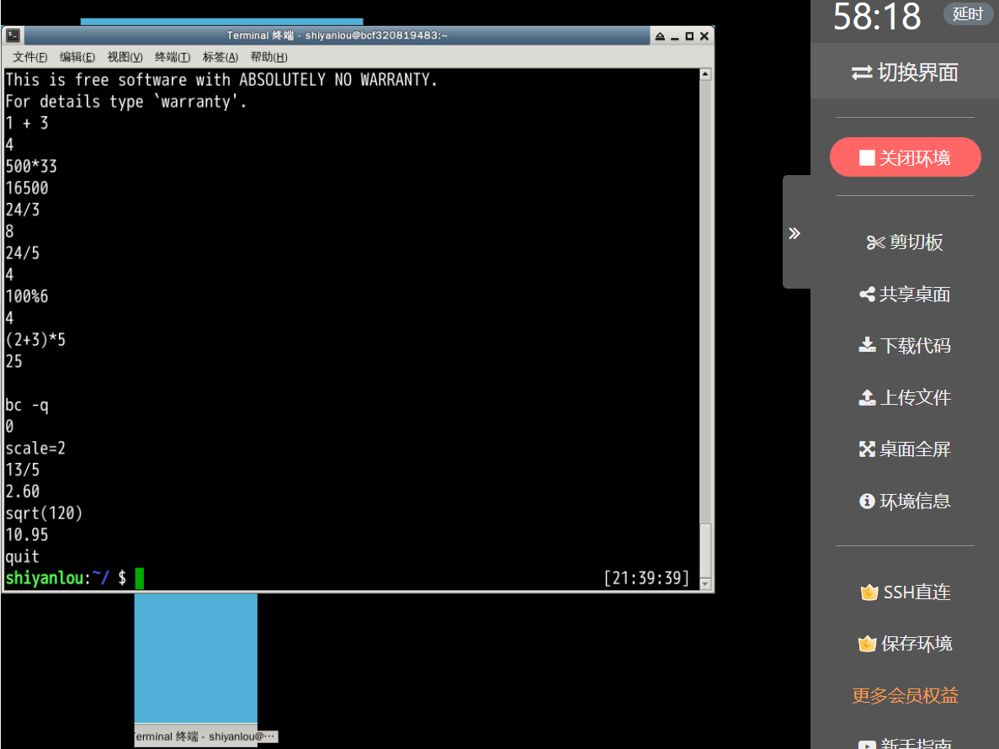
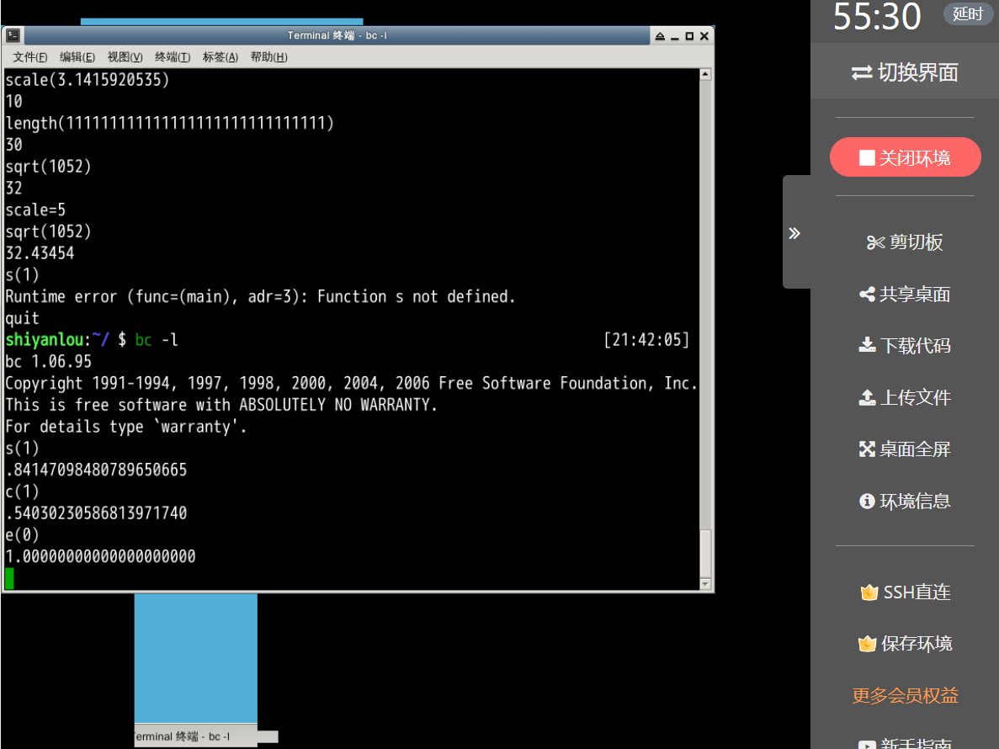
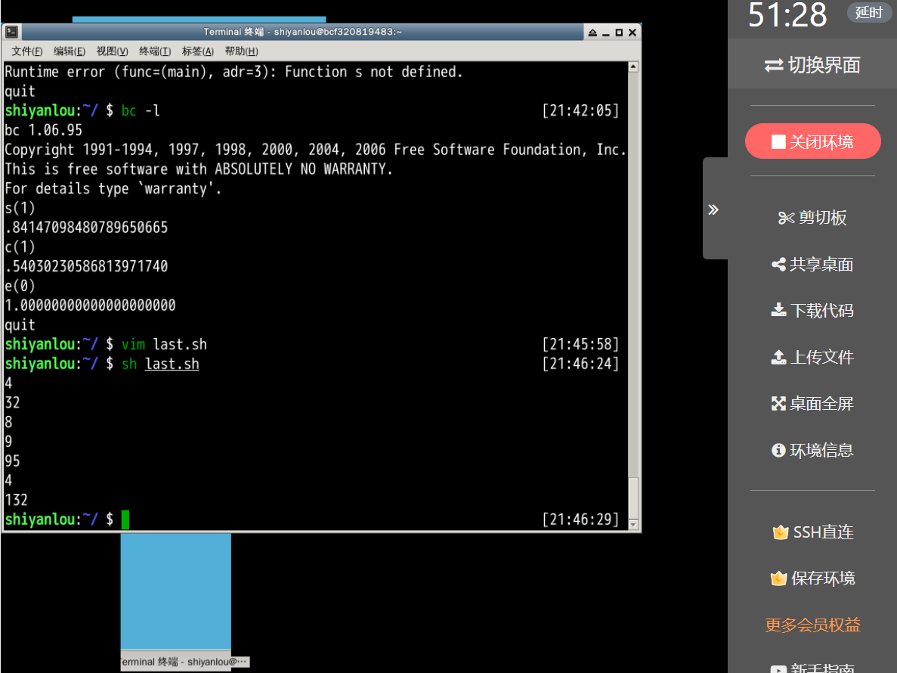
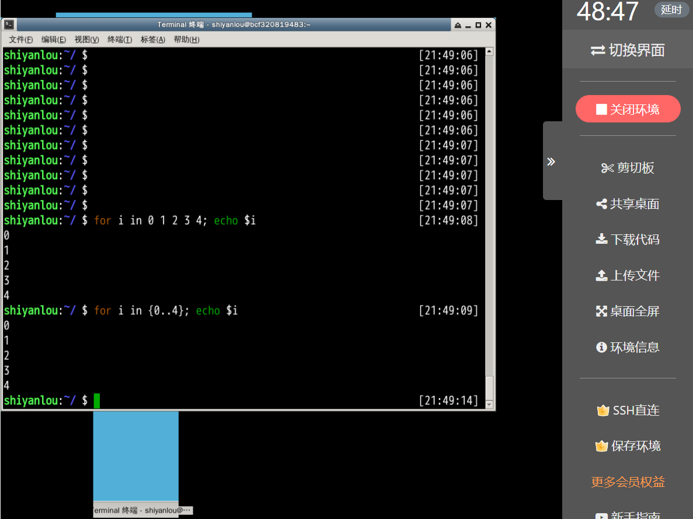

## 表达式与运算符实验报告

> 任栋 20052219
>
> 2022-06-02

### expr命令

#### 1.1 基本算术运算

**【试一试】**用vim编辑器编写如下脚本expr.sh，然后执行。

```shell
$ vim expr.sh
```

```bash
#!/bin/bash

a=10
b=20

# 加法
ret=`expr $a + $b`
echo "a + b : $ret"

# 减法
ret=`expr $a - $b`
echo "a - b : $ret"

# 乘法
ret=`expr $a \* $b`
echo "a * b : $ret"

# 除法
ret=`expr $b / $a`
echo "b / a : $ret"

# 取余除
ret=`expr $b % $a`
echo "b % a : $ret"

```

运算结果



#### 1.2 逻辑运算

```bash
#!/bin/bash

a=10
b=20

ret=`expr $a < $b`
echo "a < b : $ret"

ret=`expr $a = $b`
echo "a = b : $ret"

ret=`expr $a != $b`
echo "a != b : $ret"

ret=`expr $b >= $a`
echo "b >= a : $ret"

```

运行结果



可以看出第一个和第四个没有正确运算，添加转义字符即可

```bash
#!/bin/bash

a=10
b=20

ret=`expr $a \< $b`
echo "a < b : $ret"

ret=`expr $a = $b`
echo "a = b : $ret"

ret=`expr $a != $b`
echo "a != b : $ret"

ret=`expr $b \>= $a`
echo "b >= a : $ret"

```

运行结果



#### 1.3 字符串运算

编写expr字符串用法中的match、length、index功能。

```bash
#!/bin/bash

ret=`expr match "narcissistic my god i love it" "narcissistic"`
echo $ret

ret=`expr length "you make me feel like eleven"`
echo $ret

ret=`expr index "it\'s my fiesta" f`
echo "$ret"

```

运行结果



### test命令

#### 2.2 求值

先将所有命令放在sh文件中。

```bash
a=1
b=01
c=2

test $a = $b
echo $?

test $a -eq $b
echo $?

test $a -lt $c
echo $?

test -n $a
echo $?

test -z $a
echo $?

test -n $f
echo $?

test -z $f
echo $?

```

运行结果



判断文件 `/usr/sbin/anacron` 是否存在，且具有执行权限。需要使用 `-x` 。

判断 `/dev/sda` 磁盘是否是块设备，是块设备则为真。需要使用 `-b` 。

判断变量 `a` 的值是否在 `18` 到 `28` 之间（含18和28）。需要使用 `-a` 和 `-ge` `-le` 。

判断文件是否是空文件，是空文件则为真。需要使用 `-s` 。

根据上述简要分析编写了下方sh文件

```bash
test -x /usr/sbin/anacron
echo $?

test -b /dev/sda
echo $?

a=20

test $a -ge 18
echo $?

test $a -le 28
echo $?

test $a -ge 18 -a $a -le 28
echo $?

a=30

test $a -ge 18
echo $?

test $a -le 28
echo $?

test $a -ge 18 -a $a -le 28
echo $?

touch b.txt

test -s b.txt
echo $?

test -s expr2.sh
echo $?

```

运行结果



### bc工具

#### 安装bc

apt命令安装一下bc

```shell
sudo apt install -y bc
```

#### 算术运算

进入bc的计算环境

```shell
$ bc
```

运行了一些用例中给出的基本运算和精度



运行了用例中给出的一些库函数。第二次运行时命令更改为

```shell
$ bc -l
```



### 双小括号、中括号

先将用例全部放在sh中

```bash
echo $((1+3))

b=$(((a=5+3)*(8-4)))
echo $b
echo $a

((a++))
echo $a

echo $((16#5f))

b=$[1+3]
echo $b


b=$[(15+29)*3]
echo $b

```

运行结果



### 循环

在shell中直接编写

```shell
$ for i in 0 1 2 3 4; echo $i
$ for i in {0..4}; echo $i
```

运行结果



### 总结

在学习前两个命令 expr 和 test 时，由于接触较少，网上的资料并不全面，有些资料甚至勘误，所以自己调试了很多次。

在双尖引号之间需要用转义字符，不然expr中的逻辑运算符是不能工作的。test match需要填写正则表达式，如果不希望匹配字符，要在后方加\*号，如果匹配用的字符串没有空格可以尝试去掉引号。
